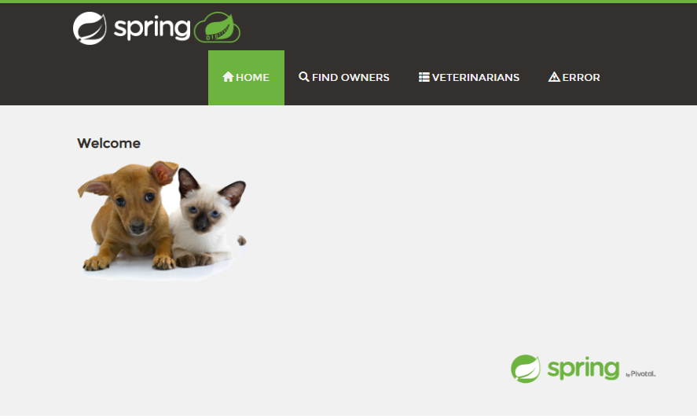

This is the [Spring PetClinic Sample Application](https://github.com/spring-projects/spring-petclinic) originally forked and modified here for Azure deployments.

# Prerequisites

* Azure Account
* Maven

# Clone Project

1. Clone Project as follows:

	```
	git git@ssh.dev.azure.com:v3/nowlab/castor/castor
	cd castor
	```

# Deploy Locally

1. Clone Project

	```
	git clone git@github.com:advlab/castor.git
	cd castor
	```

1. Run Project locally

    ```
    ./mvnw spring-boot:run
    ```

1. Test Local URLs

    ```
    http://localhost:8080
    ```